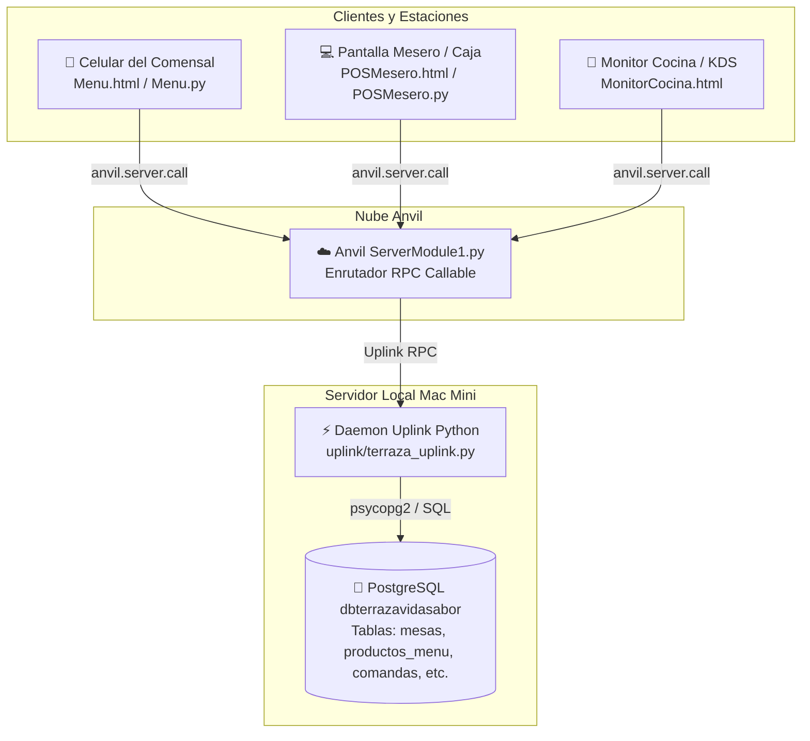

# Estado del Proyecto: La Terraza de Vida & Sabor (V&S)

> **Documento de Control de Avances, Arquitectura y Estado de Funcionalidades**  
> **Fecha:** 4 de Septiembre de 2026  
> **Sistema:** POS Inteligente + Menú Digital QR + KDS Cocina + PostgreSQL + Anvil Uplink

---

## 1. Resumen Ejecutivo y Propósito

El sistema **La Terraza de Vida & Sabor** es una plataforma integral e independiente para la operación gastronómica de la Terraza, diseñada para funcionar con una base de datos local en **PostgreSQL (`dbterrazavidasabor`)** alojada en la Mac Mini y una interfaz gráfica responsiva operada a través de **Anvil.works**.

### Objetivos Clave:
1. **Comanda y Atención por Silla (Portavasos QR):** Cada asiento físico (Mesa 1..3, Sillas 1..4) cuenta con un código QR único (ej. `PV-011`, `PV-012`). El comensal escanea desde su celular y puede armar su comanda individual o pedir platillos compartidos al centro.
2. **Croquis Interactivo del Mesero (`POSMesero`):** Panel táctil/desktop con vista panorámica de las 3 mesas, estados de sillas en vivo (Verde = Disponible, Naranja = Ocupada, Azul = Sobremesa/Pagada), unión de mesas y *Drag & Drop* de sillas para transferir o unificar consumos.
3. **Cobro Flexible y Cuentas Divididas:** Permite cobrar por silla individual, seleccionar varias sillas en un solo ticket o cobrar la mesa completa, con cálculo de IVA (16%), propinas y métodos de pago bancarizados o efectivo.
4. **Monitor de Cocina / KDS (`MonitorCocina`):** Despacho de comandas separadas por estación de preparación (*Cocina* vs *Barra de Café*).
5. **Única Fuente de la Verdad:** Toda la información de catálogo, categorías, mesas y transacciones reside de forma centralizada en la base de datos PostgreSQL.

---

## 2. Arquitectura del Sistema

---

## 3. Inventario de Componentes y Archivos

| Módulo / Archivo | Ubicación en Proyecto | Función Principal | Estado |
| :--- | :--- | :--- | :--- |
| **Base de Datos** | `database/init_terraza.sql` | Esquema relacional PostgreSQL (`categorias`, `productos_menu`, `mesas`, `comandas`, `detalle_comanda`, `pagos`). | ✅ Completo |
| **Uplink Daemon** | `uplink/terraza_uplink.py` | Servicio persistente en Python que conecta Anvil con PostgreSQL `dbterrazavidasabor`. | ✅ Conectado |
| **Server Module** | `server_code/ServerModule1.py` `server/ServerModule1.py` | Puente transparente en Anvil para delegar consultas RPC al Uplink. | ✅ Actualizado |
| **POS Mesero (UI)** | `anvil/forms/pos_mesero/POSMesero.html` | Croquis interactivo 3 mesas x 4 sillas, Drag & Drop, comandas por silla, cobro dividido. | ✅ Funcional |
| **POS Mesero (Py)** | `anvil/forms/pos_mesero/POSMesero.py` | Inicialización de `POSMeseroTemplate`, router URL y timer de sincronización (2s). | ✅ Funcional |
| **Menú Móvil (UI)** | `anvil/forms/menu/Menu.html` | Menú comensal para celular, modal de personalización gourmet, notas de chef y extras. | ✅ Rediseñado |
| **Menú Móvil (Py)** | `anvil/forms/menu/Menu.py` | Inicialización de `MenuTemplate`, detección de parámetros QR (`#mesa=X&silla=Y`) y check-in. | ✅ Funcional |
| **Config Anvil** | `anvil.yaml` | Configuración de app Anvil (`startup_form: POSMesero`). | ✅ Actualizado |

---

## 4. Estado Detallado de Funcionalidades

### ✅ A. Funcionalidades Completadas y Validadas

1. **Catálogo y Menú Real de La Terraza:**
   - Categorías reales: *Bebidas & Jugos*, *Huevos & Omelettes*, *Especialidades Mexicanas*, *Dulces Americanos*, *Combos Recomendados*, *Menú Infantil*.
   - Productos con precios reales en PostgreSQL (ej. Café Americano de la Olla $45, Capuchino $68, Omelette Supremo $155, Chilaquiles Verdes $148, Refresco $38).
2. **Experiencia Móvil del Comensal (`Menu.html`):**
   - Header limpio con accesos directos: `🔔 Llamar Mesero` y `🧾 Pedir Cuenta`.
   - Hub de bienvenida simplificado (se retiraron textos redundantes y diagramas de 4 sillas innecesarios).
   - Acciones principales: *Ordenar a Mi Silla*, *Pedir al Centro* y *Mi Comanda*.
   - Modal Gourmet de Personalización: Selección de términos (término medio, bien cocido, claras), chips de exclusión (`🚫 Sin cebolla`, `🌶️ Salsa aparte`, `🫘 Sin frijoles`), extras con costo adicional dinámico (`+ Aguacate $25`, `+ Tocino $35`) y notas especiales para cocina.
   - Banner comanda fija inferior con conteo de platillos y total.
3. **Croquis y Control de Sala (`POSMesero.html`):**
   - 3 Mesas con 4 sillas cada una + soporte de sillas arrimadas (5 a 10).
   - Botones para unir mesas (`Unir 1-2`, `Unir 2-3`, `Unir Toda la Terraza 1-2-3`) y separación inmediata.
   - *Drag & Drop* HTML5 nativo: Arrastrar una silla hacia otra para mover comensal o combinar cuentas en un solo asiento.
   - Modal de Comanda con desglose por silla, indicador de items *Pendientes* vs *🟢 En Cocina*, subtotal, IVA, propina y botón de cobro.
4. **Ciclo de Cobro y Facturación:**
   - Soporte de pagos en Efectivo, Tarjeta y Transferencia.
   - Registro en PostgreSQL de `comandas`, `detalle_comanda` y `pagos` con número de folio (`VS-TICK-XXXX`).
5. **Check-in Inicial por QR:**
   - Cuando el teléfono escanea el QR de la silla, el sistema ejecuta `checkin_silla_qr`, registrando la ocupación.

---

### ⚠️ B. Puntos Críticos en Diagnóstico y Pendientes por Resolver

#### 1. Sincronización en Tiempo Real de Consumos (Celular $\rightarrow$ POS Mesero)
- **Comportamiento observado:** Al escanear una silla (ej. Silla 4) y seleccionar una bebida o platillo desde el teléfono, el pedido aparece correctamente en el teléfono como *Pendiente*, pero la pantalla del mesero no refleja la ocupación de la silla ni el producto agregado en tiempo real.
- **Causa Raíz Identificada:**
  1. **Aislamiento de Entornos en Anvil:** Cuando se prueba en la computadora haciendo clic en **Run** (Entorno *Development/Debug*), y el celular escanea la URL publicada (Entorno *Published*), Anvil ejecuta dos entornos independientes. El daemon Uplink local estaba conectado a *Published*, por lo que las peticiones del entorno *Development* no se enrutaban al mismo proceso.
  2. **Persistencia Stateless en Cloud:** Si una llamada de servidor no llega al Uplink, Anvil la ejecuta en un contenedor efímero en la nube que no comparte memoria RAM con otros navegadores.
- **Acción requerida para finalizar:**
  - Garantizar que las llamadas de `actualizar_cuenta_silla` y `checkin_silla_qr` se ejecuten siempre a través del Uplink persistente de PostgreSQL o unificar el entorno de pruebas en la misma URL de producción.

#### 2. Ciclo de Cierre y Seguridad de Sesión QR
- **Requerimiento:** Asegurar que cuando un comensal paga y el mesero libera la silla ("Desocupar"), si el cliente abre el link más tarde desde su casa, la comanda esté bloqueada y no permita enviar pedidos no deseados a cocina.
- **Solución diseñada:** Inserción de `session_token` / estampa de tiempo al abrir la cuenta. Si el estado en PostgreSQL es `disponible` o `cerrada`, la interfaz muestra aviso de "Cuenta finalizada" y deshabilita botones de pedido.

---

## 5. Historial de Decisiones Técnicas (Changelog Reciente)

1. **Unificación a PostgreSQL:** Se descartó el uso de tablas duplicadas en Anvil Data Tables para mantener a PostgreSQL como la única fuente centralizada de datos.
2. **Reemplazo de Ficha Técnica por Modal Gourmet:** Se eliminó la visualización de recetas de cocina interna en la vista del cliente y se implementó un modal de personalización con extras cotizados en tiempo real.
3. **Corrección de Importación en Anvil Designer:** Se corrigió el error `RuntimeError: _anvil_designer module missing attribute 'MenuTemplate'` en `POSMesero.py` restaurando `POSMeseroTemplate`.
4. **Formulario de Inicio Predeterminado:** Se estableció `POSMesero` como `startup_form` en `anvil.yaml` para que al abrir el sistema en la computadora siempre inicie en el croquis panorámico de mesas.
5. **Sincronización en Bebidas Rápidas:** Se agregó la llamada `window.anvilSyncCuenta` dentro de `agregarAlCarritoDirecto` en `Menu.html` para que los refrescos y bebidas directas se transmitan de inmediato al servidor.

---

## 6. Próximos Pasos para la Siguiente Sesión

1. Validar la recepción de eventos en `uplink/terraza_uplink.py` ejecutando la prueba completa en el entorno publicado (`Published URL`).
2. Comprobar que al tocar un refresco en el teléfono en la Silla 4, el log de `terraza_uplink.py` imprima:  
   `📝 [UPLINK] Cuenta actualizada: Mesa 1 Silla 4 -> 1 items (ocupada)`  
   y el croquis en la computadora cambie a naranja en 1 segundo.
3. Activar el mecanismo de caducidad de sesión QR cuando el mesero presione "Cobrar / Desocupar Silla".
