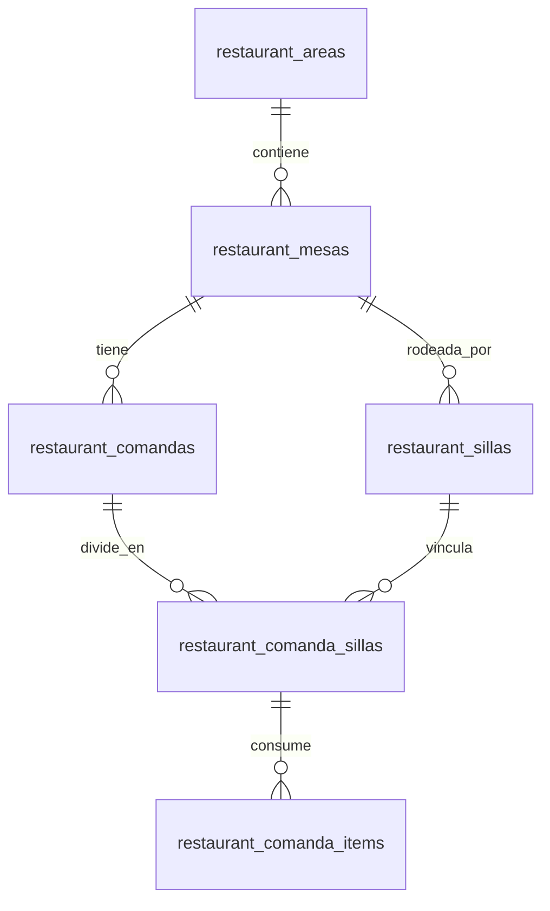

# 🌿 Arquitectura POS Restaurante: Área 1 - Palapa (6 x 4 mt)

Este documento detalla la **presentación gráfica** y el **diseño de base de datos** para la gestión del restaurante dividida por áreas, mesas y cuentas individuales por silla.

---

## 🎨 1. Plano Gráfico 2D (Vista Superior - Top Down)

A continuación se muestra la representación espacial a escala del **Área 1: Palapa** ($6.00\text{ m} \times 4.00\text{ m}$):

### Elementos Representados:
1. **Fondo (Mueble de Servicio / Barra de Café)**:
   * Ubicado en la pared posterior ($6\text{ m}$).
   * Equipado con: Máquina de café espresso, lavatrastes pequeño, cristalería (vasos/copas) y espacio de insumos.
2. **Distribución Principal**:
   * **3 Mesas circulares** de 4 personas cada una (**Mesa 1**, **Mesa 2**, **Mesa 3**).
   * **12 Sillas identificadas individualmente** (Mesa 1 - Silla 1 a 4, Mesa 2 - Silla 1 a 4, Mesa 3 - Silla 1 a 4).
3. **Flujo de Pasillo**:
   * Entrada frontal clara con circulaciones fluidas hacia el mueble de servicio y entre mesas.

---

## 🗄️ 2. Base de Datos Lista para Pruebas (SQL Schema)

Se ha generado e instalado el archivo de migración en [`database/migrations/022_restaurant_pos_areas_mesas_sillas.sql`](file:///Users/jreyes/vidaspa-system/database/migrations/022_restaurant_pos_areas_mesas_sillas.sql).

### Estructura de Tablas Creadas:

1. **`restaurant_areas`**: Almacena las dimensiones y nombres (*Palapa*, *Patio Central*, *Chimenea*).
2. **`restaurant_mesas`**: Define posición $(X, Y)$, número de mesa, capacidad y estado (*disponible*, *ocupada*, *cuenta_solicitada*).
3. **`restaurant_sillas`**: Identificación única por asiento (ej: `numero_silla` 1..4 por mesa).
4. **`restaurant_comandas`**: Ticket general de la mesa.
5. **`restaurant_comanda_sillas`**: Cuentas individuales asignadas a cada silla (permite cobro separado por persona).
6. **`restaurant_comanda_items`**: Detalle de platillos/bebidas consumidos específicamente por cada silla.

---

## ⚡ 3. Funcionamiento Operativo del Levantamiento de Pedidos

1. **Al llegar los clientes**:
   * El mesero toca la **Mesa 1** en la pantalla.
   * La mesa cambia de 🟩 **Verde (Libre)** a 🟦 **Azul (Ocupada)**.
2. **Al tomar la orden por comensal**:
   * El mesero toca la **Silla 2** de la Mesa 1.
   * Agrega: *1 Café Capuchino + 1 Omelette*.
   * El consumo queda asignado a la **Silla 2**.
3. **Al momento de pagar**:
   * Si piden la cuenta individual: Se imprime el desglose exclusivo de la **Silla 2**.
   * Si piden la cuenta junta: El sistema consolida automáticamente las 4 sillas en una sola comanda final.
